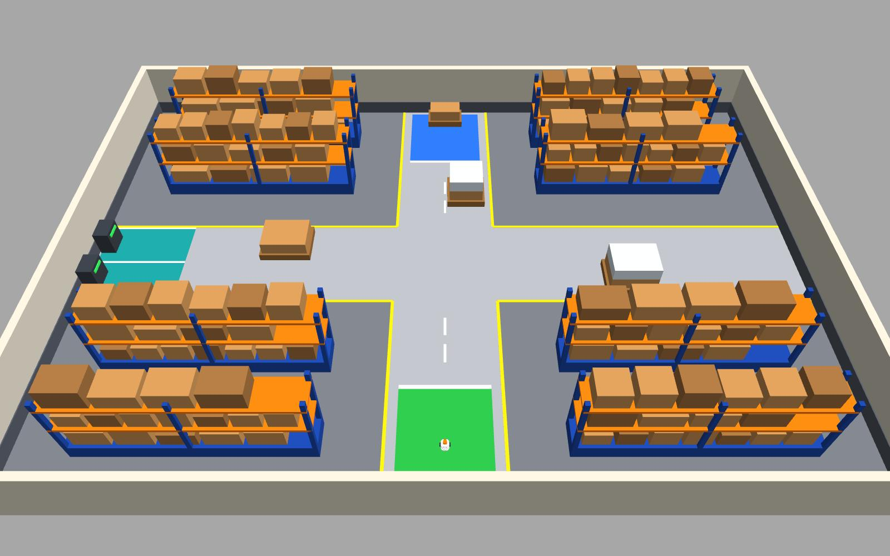
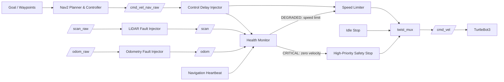

# ROS2 Fault-Tolerant Autonomous Mobile Robot

**Fault diagnosis, degraded control, safe stop, and recovery during Nav2 warehouse missions.**

> **한 줄 요약:** Nav2로 창고 waypoint 임무를 수행하는 TurtleBot3에서 LiDAR·Odometry·제어 지연·Navigation 프로세스 이상을 실제로 주입하고, 고장 수준에 따라 **감속 → Safe Stop → 복구 → 임무 재개**를 수행하는 ROS2 기반 fault-tolerant AMR 시스템입니다.



## Why this project?

Autonomous mobile robots usually operate under the assumption that sensors, control messages, and navigation processes remain healthy.

This project focuses on the opposite case:

> **What should the robot do when a sensor becomes unavailable, odometry becomes implausible, control commands are delayed, or a navigation process fails?**

Instead of only detecting an error, the system evaluates fault severity and changes robot behavior in stages:

**NORMAL → WARNING → DEGRADED → CRITICAL**

- **WARNING** — detect and monitor abnormal behavior
- **DEGRADED** — continue operation with reduced performance
- **CRITICAL** — override normal commands and force a safe stop
- **RECOVERY** — return to normal operation only after a healthy hold period

The current system runs a real Nav2 waypoint mission in a warehouse simulation while the fault-tolerant layer supervises and overrides the navigation output when required.

---

## At a glance

| Item | Current implementation |
|---|---|
| Robot | TurtleBot3 Burger |
| Middleware | ROS2 Humble |
| Navigation | Nav2 + AMCL + DWB |
| Simulation | Gazebo Classic 11 |
| Environment | Reproducible warehouse / AMR world |
| Faults | LiDAR dropout, odometry anomaly, control latency, navigation-process failure |
| Response | Warning, sample rejection, speed degradation, independent safe stop, recovery |
| Safety arbitration | `twist_mux` with independent high-priority safety command |
| Monitoring | tkinter dashboard + CSV / JSON result logging |
| Verification | Automated fault, regression, integrated-demo, and Nav2 mission tests |

---

## System architecture



A key design rule is that **normal navigation never owns the final robot command directly**.  
Nav2 output passes through the fault-tolerant control layer before reaching `/cmd_vel`.

---

## Fault scenarios

| Fault | How it is injected | Detection | Response |
|---|---|---|---|
| **LiDAR dropout** | Stop forwarding real `/scan` messages | Scan message age | WARNING → DEGRADED → CRITICAL → Safe Stop |
| **Odometry anomaly** | Change `twist.linear.x` to an implausible value (e.g. 2.5 m/s) | Speed bound, acceleration bound, command consistency | Reject bad sample; persistent fault → DEGRADED speed |
| **Control latency** | Actually hold navigation commands for 300 / 700 ms | Measured receive-to-publish latency | 300 ms → DEGRADED, 700 ms → CRITICAL Safe Stop |
| **Navigation process failure** | Terminate the navigation command-source process | Heartbeat age + PID change | Idle stop / Safe Stop → process respawn → healthy hold → resume |

These are **real data-flow or process faults**, not only Boolean fault flags.

---

## Fault-response policy

| System state | Robot behavior |
|---|---|
| **NORMAL** | Normal Nav2 command, up to 0.20 m/s |
| **WARNING** | Continue operation while monitoring |
| **DEGRADED** | Limit final velocity to approximately 0.10 m/s |
| **CRITICAL** | High-priority zero command overrides navigation |
| **RECOVERY** | Keep degraded/stopped state until healthy data is stable for ~2 s |

Hysteresis and consecutive-sample conditions are used to avoid state chattering.

---

## Autonomous warehouse mission

The final simulation environment is a **14 m × 10 m indoor warehouse** with shelves, narrow aisles, intersections, pallets, a start zone, charging area, and delivery zone.

The world and occupancy map are generated from the same geometry definition so they remain reproducible and aligned.

Current mission:

```text
Start
  ↓
Central Intersection
  ↓
East Cross Aisle
  ↓
North-East Narrow Aisle
  ↓
Delivery Zone
```

### Representative Nav2 result

| Metric | Result |
|---|---:|
| Waypoints reached | **4 / 4** |
| Mission success | **True** |
| Mission time | **122.9 s** |
| Distance travelled | **19.0 m** |
| Collision count | **0** |
| Minimum map clearance | **0.398 m** |
| Final goal-position error | **0.132 m** |
| Mission retries | **0** |

During this mission, LiDAR, odometry, and control-latency faults are injected while Nav2 is actively navigating. After the fault response and recovery hold, the mission continues to the final Delivery goal.

---

## Representative fault results

| Scenario | Measured behavior |
|---|---|
| **LiDAR dropout** | CRITICAL in ~**0.95 s**, final command **0.00 m/s**, stopped-window movement **0.0 mm**, recovery to NORMAL ~**2.14 s** |
| **Odometry anomaly** | Injected **2.5 m/s** value rejected; persistent anomaly → DEGRADED in ~**0.15 s**; final velocity limited to **0.10 m/s** |
| **300 ms control delay** | Measured latency ~**0.303 s**, system enters DEGRADED |
| **700 ms control delay** | Measured latency ~**0.703 s**, CRITICAL in ~**0.46 s**, final command **0.00 m/s**, stopped-window movement **0.0 mm** |
| **Navigation process crash** | Old PID disappears, a new process is respawned, robot remains stopped until the healthy hold completes, then motion resumes |

Selected machine-readable results are committed under:

- `results/final_summary.csv`
- `results/final_summary.json`
- `results/nav2_summary.csv`
- `results/nav2_summary.json`

Raw runtime logs are intentionally excluded from Git.

---


## Nav2 Lifecycle Recovery

The Nav2 stack is now supervised at runtime and can recover from lifecycle faults and an actual controller process crash while the warehouse mission is active.

Monitored lifecycle nodes:

- `controller_server`
- `planner_server`
- `bt_navigator`
- `behavior_server`

The recovery manager checks lifecycle state at runtime and treats inactive, missing, or unresponsive nodes as a navigation-stack fault. The Nav2 stack state is integrated into the same system severity model used by the sensor and control faults.

Representative behavior:

- controller or planner deactivation is detected and escalates to CRITICAL
- the high-priority safety path forces the robot to stop
- the lifecycle manager is used to restore the navigation stack
- after a healthy hold, the active waypoint mission resumes
- an actual `controller_server` process crash is detected, respawned with a new PID, restored to ACTIVE, and the mission continues
- a recovery-block mode verifies that failed recovery keeps the robot in CRITICAL with zero movement

Validated odometry is also connected to the relevant Nav2 velocity-feedback path:

```text
Gazebo /odom_raw
      |
      v
odom_fault_injector
      |
      v
     /odom
      |
      v
health_monitor plausibility check
      |
      v
/odom_validated
      |
      +--> controller_server
      +--> bt_navigator
```

Implausible odometry samples are therefore rejected before they are used as Nav2 velocity feedback, while the odom-to-base TF and AMCL localization path remain unchanged.

### Recovery verification

The automated Nav2 recovery test passed **42/42 checks in three consecutive runs**.

Representative results:

| Scenario | Result |
|---|---|
| Controller deactivate | CRITICAL stop → lifecycle recovery → mission resume |
| Planner deactivate | CRITICAL stop → lifecycle recovery → mission resume |
| Controller process crash | Old PID disappears → new PID respawned → stack ACTIVE → mission resume |
| Recovery blocked | Max attempts reached → CRITICAL maintained → 0.0 mm movement |
| Recovery unblocked | Stack recovers → NORMAL → mission resumes |
| Odometry corruption | 2.5 m/s corrupted sample rejected from `/odom_validated` |

The extended recovery mission reached **5/5 waypoints** and completed the Delivery mission with **0 collisions**.

Selected results:

- `results/nav2_recovery_summary.csv`
- `results/nav2_recovery_summary.json`

## Dashboard

The monitoring dashboard shows the system state in real time:

- overall **NORMAL / WARNING / DEGRADED / CRITICAL** state
- individual LiDAR, odometry, control-latency, and navigation health
- scan age, odometry validity, measured control latency, navigation heartbeat / PID
- target velocity, final command, measured odometry velocity
- degraded speed limit and safety-stop state
- waypoint mission progress
- recent fault and state-transition events
- buttons for manual fault injection

The same services used by the automated tests are used by the dashboard, so the UI does not contain separate fault logic.

---

## Engineering decisions

### 1. Independent safety command path

The safety command does not compete with Nav2 at the same priority.

```text
/cmd_vel_safety      priority 255
/cmd_vel_nav_limited priority 10
/cmd_vel_idle_stop   priority 1
```

This allows a CRITICAL state to override a continuing non-zero Nav2 command.

### 2. Fail-safe behavior when navigation commands disappear

A low-priority zero-velocity source remains active.  
If the normal navigation publisher disappears, `twist_mux` falls back to the idle-stop command instead of leaving the robot on a stale velocity command.

### 3. Fault injection changes the real signal path

Examples:

- LiDAR: `/scan_raw → injector → /scan`
- Odometry: `/odom_raw → injector → /odom`
- Control latency: navigation commands are actually queued and delayed
- Navigation failure: the process is actually terminated and respawned

### 4. Reproducible simulation environment

The warehouse world and 2D occupancy map are generated from the same obstacle geometry rather than maintained independently.

---

## Automated verification

| Test suite | Result |
|---|---:|
| Fault 1 — LiDAR | **23 / 23 PASS** |
| Fault 2 — Odometry | **21 / 21 PASS** |
| Fault 3 — Control latency | **36 / 36 PASS** |
| Fault 4 — Navigation process | **36 / 36 PASS** |
| Integrated fault demo | **25 / 25 PASS** |
| Nav2 warehouse fault demo | **25 / 25 PASS** |

The integrated demo and Nav2 demo have also been repeated successfully in GUI runs, while the original regression suites remain passing.

---

## Run the project

### Environment

- Ubuntu 22.04
- ROS2 Humble
- Gazebo Classic 11
- TurtleBot3 Burger
- Nav2
- `twist_mux`
- Python 3 / rclpy

> Current helper scripts assume the workspace path is `~/capstone_fault_ws`.

Build:

```bash
cd ~/capstone_fault_ws
colcon build --symlink-install
source env.sh
```

### Warehouse + Nav2 + dashboard

```bash
./run_nav2.sh dashboard:=true autostart_mission:=true
```

### Automated Nav2 + fault demo

```bash
./run_nav2_demo.sh
```

This runs the warehouse waypoint mission while automatically injecting Fault 1 / 2 / 3 and writes `results/nav2_summary.*`.

### Warehouse integrated fault demo

```bash
./run_warehouse_demo.sh
```

### Individual regression tests

```bash
./run_fault1_test.sh
./run_fault2_test.sh
./run_fault3_test.sh
./run_fault4_test.sh
```

---

## Repository structure

```text
.
├── src/
│   ├── fault_injector/      # LiDAR, odometry, control-delay, navigation fault injection
│   ├── fault_monitor/       # health monitoring, speed limiting, idle stop
│   └── fault_bringup/       # launch, dashboard, Nav2 mission, maps, worlds, configs
├── docs/images/             # presentation / portfolio images
├── results/                 # selected quantitative summaries
├── run_nav2.sh
├── run_nav2_demo.sh
├── run_warehouse_demo.sh
├── run_integrated_demo.sh
└── run_fault*_test.sh
```

---

## Current status

### Completed

- [x] TurtleBot3 + Gazebo simulation baseline
- [x] LiDAR dropout detection and Safe Stop
- [x] Odometry plausibility monitoring and degraded control
- [x] Real control-latency injection and response
- [x] Navigation process failure / respawn test
- [x] Independent safety arbitration with `twist_mux`
- [x] Monitoring dashboard
- [x] Reproducible warehouse AMR environment
- [x] Nav2 4-waypoint autonomous mission
- [x] Fault 1 / 2 / 3 response during active Nav2 navigation
- [x] Automated regression and quantitative summaries

### In progress

- [x] Nav2 lifecycle-node failure detection and automatic recovery
- [x] Feed validated odometry into the relevant Nav2 velocity-feedback path

### Planned

- [ ] Scenario manager for reproducible multi-fault experiments
- [ ] Expanded quantitative evaluation
- [ ] Optional real-robot deployment

---

## Scope

This is an implementation-focused university capstone project for studying runtime fault handling in autonomous mobile robots.

The design uses concepts such as fault detection, degraded operation, safe stop, and recovery, but it **does not claim ISO 26262, SOTIF, or other functional-safety certification compliance**.
